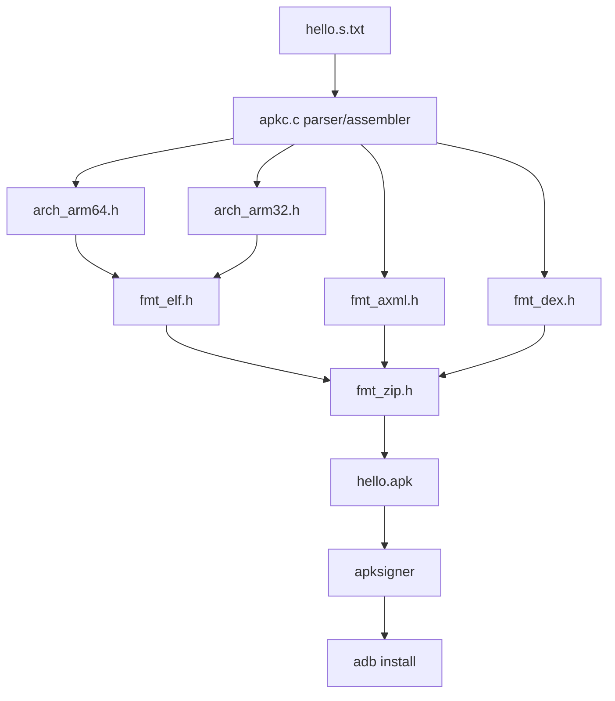

# ApkC — estrutura auditável

## Árvore visual

```text
Apkc/
├── apkc.c
├── sys.h
├── mem.h
├── fmt_zip.h
├── fmt_dex.h
├── fmt_axml.h
├── fmt_elf.h
├── arch_arm64.h
├── arch_arm32.h
└── proofs/
```

## Fluxo técnico



## Separação de responsabilidades

| Área | Arquivos | Prova esperada |
|---|---|---|
| Parser/assembler | `apkc.c` | compilação e geração de APK |
| ARM64 | `arch_arm64.h` | `readelf` em `.so` arm64 |
| ARM32 | `arch_arm32.h` | `readelf` em `.so` arm32 |
| ZIP/APK | `fmt_zip.h` | `unzip -l` |
| AndroidManifest AXML | `fmt_axml.h` | `aapt dump xmltree` |
| DEX | `fmt_dex.h` | SHA-1 interno do DEX |
| Evidências | `Apkc/proofs/` | relatórios e saídas brutas |
