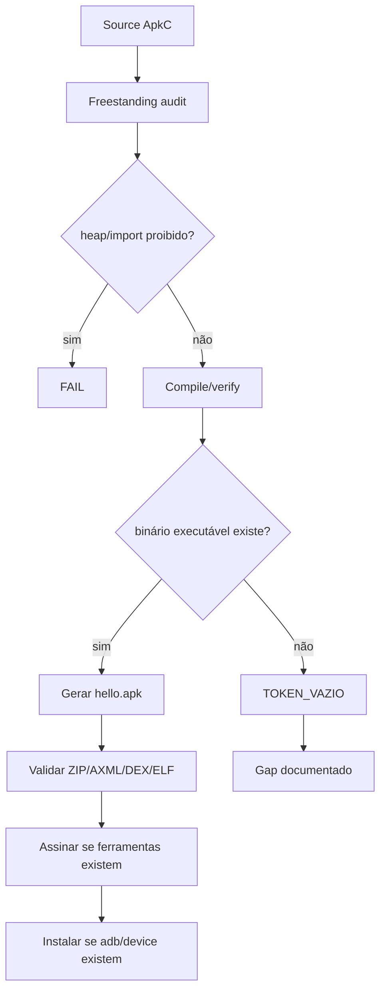

# CI Compiler Excellence — condução operacional

**Estado:** `CANONICAL`  
**Proprietário lógico:** `ci-governance`  
**Repositório:** [`rafaelmeloreisnovo/RafPolimata`](https://github.com/rafaelmeloreisnovo/RafPolimata) — `docs/CI_COMPILER_EXCELLENCE/README.md`

> **Entrada canônica:** docs/AGENTES.md §7 (CI gates — 15+ gates em `.github/workflows/ci.yml`, condução freestanding-first) e §5 (pipeline operacional VOID → VALIDATED — este diretório implementa a prova de evidência de cada gate).

Este diretório descreve a condução técnica para transformar o CI em um **compilador de evidências**: pequeno, auditável, freestanding-first, sem heap no núcleo ApkC, com rollback/failsafe documentados e sem alegar prova que não existe.

## Princípios

| Princípio | Regra operacional | Evidência |
|---|---|---|
| Sem heap no núcleo ApkC | bloquear `malloc`, `calloc`, `realloc`, `free` em `Apkc/*.c` e `Apkc/*.h` | `ci/reports/freestanding-audit.md` |
| Freestanding-first | preferir `-nostdlib`, syscall explícita e buffers estáticos no ApkC | `scripts/apkc_validate.sh` |
| Sem dependência oculta | ferramenta ausente vira `TOKEN_VAZIO` | `Apkc/proofs/out/*.txt` |
| Falha real não é escondida | compilação/verificação básica falha com exit não-zero | CI |
| Rollback | artefatos gerados ficam em `Apkc/proofs/out/` e não substituem fontes | `.gitignore` |
| Failsafe | scripts param em erro real via `set -eu` | scripts executáveis |

## Árvore de condução

```text
docs/CI_COMPILER_EXCELLENCE/
├── README.md
├── FLAGS_MATRIX.md
└── ROLLBACK_FAILSAFE.md
ci/
├── profiles/
│   └── apkc-freestanding.flags
└── reports/
    └── freestanding-audit.md
```

## Pipeline metódico



## Checklists GitHub-friendly

- [ ] Cada warning novo tem dono, arquivo e próxima ação.
- [ ] Cada flag tem motivo técnico e risco documentado.
- [ ] Cada arquitetura tem rota explícita: `generic`, `arm32`, `arm64`.
- [ ] Cada ausência de ferramenta gera `TOKEN_VAZIO`.
- [ ] Cada sucesso aponta para artefato verificável.
