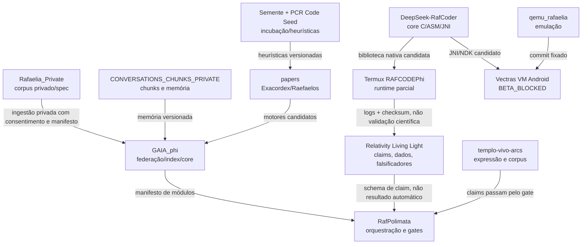

# Mapa Multiplex RLL/RAFAELIA — Ecossistema GitHub

> Estado: `AUDIT / evidence-gated / no silent integration`
>
> Data de varredura: 2026-07-15
>
> Regra: nome, metáfora ou referência cruzada não prova integração. Cada ligação precisa de repositório dono, caminho, contrato, teste e artefato.

## 1. Objetivo

Este documento amplia o mapa de convergência existente sem colapsar repositórios diferentes em uma identidade única. O ecossistema é tratado como uma rede multiplex:

```text
conhecimento científico
  + memória/corpus privado
  + orquestração semântica
  + motores e heurísticas
  + runtime Android/Termux/VM
  + publicação e linguagem verbo-espiritual
  + governança de evidência
```

A relação correta é:

```text
repositório -> papel observado -> evidência -> estado -> interface candidata -> gate
```

## 2. Vocabulário de estado

| Estado | Significado |
|---|---|
| `VERIFIED` | Arquivo, contrato ou comportamento diretamente localizado no repositório dono. |
| `VERIFIED_LIMITED` | Evidência concreta existe, mas cobre somente um comportamento estreito. |
| `DECLARED_BY_REPO` | O próprio repositório declara a função; ainda requer teste ou auditoria independente. |
| `AUDIT` | Conteúdo existe, mas precisa de inventário, reconciliação ou classificação de claims. |
| `BETA_BLOCKED` | Projeto estruturado, porém bloqueado para afirmação de estado corrente/produção. |
| `PARTIAL` | Parte da cadeia funciona; dependências ou backends reais ainda faltam. |
| `EXPERIMENTAL` | Protótipo ou pesquisa sem contrato estável de produção. |
| `TOKEN_VAZIO` | Evidência necessária ainda não foi localizada. |
| `CLAIM_BLOCKED` | A alegação não pode ser promovida sem teste, dataset, log ou revisão externa. |

## 3. Camadas do mapa

| Camada | Função | Fontes canônicas candidatas |
|---|---|---|
| L0 — Evidência e claims | Separar hipótese, resultado, limitação e falsificador | `relativity-living-light`, RafPolimata |
| L1 — Memória e corpus | Preservar documentos, conversas, versões e proveniência | `Rafaelia_Private`, `CONVERSATIONS_CHUNKS_PRIVATE`, `MemRafcode` |
| L2 — Federação e orquestração | Indexar, relacionar, normalizar e rotear módulos | `GAIA_phi`, RafPolimata, `RafGitTools` |
| L3 — Motores e heurísticas | Executar kernels, classificadores, busca, ciclos e transformações | `papers`, `Semente`, `PCR_Rafaelia_Code_seed`, `ChipQuantum`, RafCoder |
| L4 — Runtime e dispositivos | Android, Termux, VM, QEMU, JNI/NDK e build | `termux-app-rafacodephi`, `Vectras-VM-Android`, `qemu_rafaelia`, `llamaRafaelia` |
| L5 — Publicação e expressão | Papers, manifestos, linguagem, teologia, arte e comunicação | `templo-vivo-arcs`, `CientiEspiritual`, `verbum-vivo`, `Manifesto-publico` |

## 4. Inventário principal verificado

| Núcleo | Papel observado | Evidência âncora | Estado seguro | Limite atual |
|---|---|---|---|---|
| `rafaelmeloreisnovo/relativity-living-light` | Modelo científico RLL/MCRP, rastreabilidade, dados e falsificadores | `README.md`, `ARCHITECTURE.md`, `docs/RLL_TRACEABILITY_MAP.md`, `docs/audits/CROSS_REPO_RELATIONSHIP_REGISTRY.md` | `VERIFIED` como estrutura documental e pipeline de claims | Não confirma verdade física nem integração automática com outros repos |
| `rafaelmeloreisnovo/RafPolimata` | Orquestrador semântico-técnico-jurídico; compilador de evidências e mapa cross-repo | `README.md`, `docs/AGENTES.md`, `docs/CONVERGENCIA_ECOSSISTEMA_RMR_RAFAELIA.md`, `docs/ORQUESTRADOR_FORMAL_CIENTIFICO.md` | `VERIFIED` como centro de governança/orquestração | Algumas convergências continuam candidatas, não interfaces compartilhadas |
| `rafaelmeloreisnovo/Rafaelia_Private` | Corpus privado, especificações e síntese RAFAELIA/ZIPRAF/Exacordex | `README.md` e arquivos citados nele | `AUDIT` | README mistura especificação, metáfora e alegações técnico-científicas; não deve ser tratado como runtime canônico sem testes |
| `rafaelmeloreisnovo/CONVERSATIONS_CHUNKS_PRIVATE` | Depósito privado de chunks, memória e evolução de `raf_core` | Referências em `RafPolimata/docs/CONVERGENCIA_ECOSSISTEMA_RMR_RAFAELIA.md` | `DECLARED_BY_REPO` / `AUDIT` | É distinto de `Rafaelia_Private`; a equivalência nominal anterior precisa ser abandonada |
| `rafaelmeloreisnovo/GAIA_phi` | Federação, indexação determinística, core C, engines e orquestração Python | `README.md`, `gaia_core_v2/`, `gaia_engines_v2/`, `core/`, `tests/`, `docs/` | `VERIFIED` estrutural | Federação entre repos precisa de manifesto de interface e testes cross-repo |
| `rafaelmeloreisnovo/GaiaPhiRafcode` | Satélite Gaia/RAFCODE | Metadado do repositório | `TOKEN_VAZIO` | Papel e relação com `GAIA_phi` ainda não auditados |
| `rafaelmeloreisnovo/GAIA-PDS-PHI` | Satélite GAIA/PDS/PHI | Metadado do repositório | `TOKEN_VAZIO` | Necessário inventário antes de promover vínculo |
| `rafaelmeloreisnovo/papers` | Biblioteca de motores Exacordex/Raefaelos, fontes C/ASM e artefatos ARM32 | `README.md`, `src/`, `artifacts/`, `docs/` | `VERIFIED` estrutural / `EXPERIMENTAL` científico | Nome `papers` não significa repositório editorial; predominam código e binários experimentais |
| `rafaelmeloreisnovo/Semente` | Pacote de validação e hotfixes ARM32, torus e execução Termux | `RAFAELIA_ARM32_VALIDATION_STATUS.md`, `rafaelia_torus_hex.c`, scripts de hotfix | `VERIFIED_LIMITED` | README raiz contém somente título; falta mapa fonte→teste→artefato→hash |
| `rafaelmeloreisnovo/PCR_Rafaelia_Code_seed` | Incubadora Android/boot, cognição, matriz, autoria e otimização | `rafaelia/core/cognitive.py`, `rafaelia/core/matrix_ops.py`, `rafaelia/governance/performance_optimizer.py`, fontes bootimg/magiskboot | `AUDIT` / `EXPERIMENTAL` | Não há README raiz localizado; origem/licenças e módulos canônicos precisam ser separados |
| `rafaelmeloreisnovo/Vectras-VM-Android` | Aplicação VM Android, engine, CI/release, fontes externas QEMU/AndroidX | `README.md`, `PROJECT_STATE.md`, `BUILDING.md`, `DOC_INDEX.md` | `BETA_BLOCKED` | Build atual não pode ser inferido sem CI no commit corrente; claims NEON/release dependem de evidência |
| `rafaelmeloreisnovo/termux-app-rafacodephi` | Runtime Android/terminal, JNI low-level, CTI/ZIPRAF/VCPU e bootstrap | `README.md`, `docs/STATUS.md`, `docs/RUNTIME_TRUTH_TABLE.md` | `PARTIAL` | `apt`, `dpkg`, `libapt`, repositório, certificados e `proot.real` permanecem incompletos/TOKEN_VAZIO |
| `rafaelmeloreisnovo/DeepSeek-RafCoder` | Core RAFAELOS C/ASM, primitivas por arquitetura e ponte Android JNI/NDK | `README.md`, `core/sector.c`, `core/arch/`, `android/` | `VERIFIED` estrutural / `EXPERIMENTAL` runtime | Faltam ARM32 ASM dedicado, workspace reentrante e snapshot determinístico em CI |
| `rafaelmeloreisnovo/templo-vivo-arcs` | Camada verbo-espiritual, jurídica, artística, app/dados e documentação | `README.md`, `android/`, `lib/`, `data/`, `manifests/` declarados | `AUDIT` | Metáforas estão identificadas em parte, mas afirmações neurobiológicas/físicas precisam de fonte, ensaio e claim gate |
| `rafaelmeloreisnovo/llamaRafaelia` | Pipeline de modelo/memória/CTI e runtime local | Referências cross-repo em `docs/CONVERGENCIA_ECOSSISTEMA_RMR_RAFAELIA.md` | `AUDIT` | Deve ser verificado diretamente antes de declarar integração com Termux/RafCoder |
| `rafaelmeloreisnovo/ChipQuantum` | Motor RMR/GeoLM/toroidal e kernels associados | Referências cross-repo existentes | `AUDIT` | Interfaces com RLL, GAIA e Termux continuam hipóteses até contrato/teste |
| `rafaelmeloreisnovo/qemu_rafaelia` | Base QEMU para emulação/VM | Metadado e referência no Vectras | `REFERENCE` / `AUDIT` | Deve ser consumido por commit fixado e validado pelo Vectras |
| `rafaelmeloreisnovo/RafGitTools` | Ferramentas de checkout, integração e governança Git | Metadado do repositório | `AUDIT` | Papel de orquestração precisa ser ligado a contratos reais, não duplicar RafPolimata |
| `rafaelmeloreisnovo/Mapa` | Repositório nominal de mapas | Metadado do repositório | `AUDIT` | Não deve virar nova fonte canônica sem reconciliação com este documento |

## 5. Correção de identidade obrigatória

O mapa anterior registrou:

```text
rafaelia_private -> conversations_chunks_private
```

A varredura conectada mostra que existem repositórios separados:

```text
rafaelmeloreisnovo/Rafaelia_Private
rafaelmeloreisnovo/CONVERSATIONS_CHUNKS_PRIVATE
rafaelmeloreisnovo/rafaelia_privado
```

Portanto:

1. `Rafaelia_Private` deve significar o repositório real de mesmo nome.
2. `CONVERSATIONS_CHUNKS_PRIVATE` deve manter identidade própria como corpus/chunks/memory bridge.
3. `rafaelia_privado` está vazio no metadado observado e permanece `TOKEN_VAZIO` até receber função ou ser arquivado.
4. Nenhum alias deve ser promovido sem `repository_full_name` explícito.

## 6. Heurística não é um repositório único

As heurísticas estão distribuídas por função:

| Família heurística | Localização observada | Função candidata | Estado |
|---|---|---|---|
| Seleção/construção de ciclos | `GAIA_phi/rafaelia_cycle_builder.py`, `rafaelia_cycle_indexer.c` | Construir e indexar ciclos determinísticos | `AUDIT` |
| Cognição e matriz | `PCR_Rafaelia_Code_seed/rafaelia/core/cognitive.py`, `matrix_ops.py` | Pontuação, transformação e organização de estado | `AUDIT` |
| Otimização/performance | `PCR_Rafaelia_Code_seed/rafaelia/governance/performance_optimizer.py` | Escolha de rota e parâmetros | `AUDIT` |
| Geração APK/formatos | `RafPolimata/Apkc/apkc.c` | Heurísticas de layout/geração AXML, DEX, ZIP e ELF | `EXPERIMENTAL` |
| Coerência/ARX/Q16 | `RafPolimata/Apkc/coherence.h`, `Benchmark/raf_coherence_arx.h` | Filtro determinístico e métrica de coerência | `VERIFIED` estrutural |
| Busca científica | RLL/RafPolimata | Priors, fitting, falsificadores e comparação de modelos | `PARTIAL` conforme dataset/ensaio |

Contrato recomendado para toda heurística:

```c
struct raf_heuristic_result {
    uint32_t heuristic_id;
    uint32_t version;
    uint64_t input_hash;
    int64_t score_q16;
    uint32_t confidence_q16;
    uint32_t evidence_state;
    uint64_t output_hash;
};
```

Uma heurística só sobe de `AUDIT` para `RUNTIME` quando possui:

```text
entrada canônica + versão + seed + saída determinística + baseline + teste + limite
```

## 7. Grafo de dependências seguro



Todas as arestas acima são contratos candidatos, salvo quando um teste cross-repo explícito existir.

## 8. Fontes de verdade por domínio

| Domínio | Fonte de verdade recomendada |
|---|---|
| Claims científicos RLL | `relativity-living-light` |
| Orquestração e mapa cross-repo | RafPolimata |
| Corpus privado RAFAELIA | `Rafaelia_Private` |
| Chunks/conversas/memory bridge | `CONVERSATIONS_CHUNKS_PRIVATE` |
| Federação/indexação | `GAIA_phi` |
| Runtime Termux | `termux-app-rafacodephi/docs/STATUS.md` |
| Estado da VM Android | `Vectras-VM-Android/PROJECT_STATE.md` |
| Core coder nativo | `DeepSeek-RafCoder/core/` |
| Artefatos/motores experimentais | `papers` e `Semente` |
| Narrativa verbo-espiritual | `templo-vivo-arcs`, sem promoção automática de claims físicos |

## 9. Manifesto mínimo cross-repo

Cada relação futura deve ser registrada em um arquivo como:

```json
{
  "relationship_id": "RLL-POLI-001",
  "producer_repo": "rafaelmeloreisnovo/relativity-living-light",
  "producer_path": "results/manifest.json",
  "consumer_repo": "rafaelmeloreisnovo/RafPolimata",
  "consumer_path": "data/contracts/rll_result.schema.json",
  "schema_version": "1.0.0",
  "evidence_state": "HYPOTHESIS",
  "privacy": "public",
  "input_hash": null,
  "output_hash": null,
  "test_command": null,
  "claim_boundary": "transporta resultado; não confirma modelo físico"
}
```

## 10. Próximos gates

### P0 — identidade e não colisão

- Corrigir aliases de `Rafaelia_Private`, `CONVERSATIONS_CHUNKS_PRIVATE` e `rafaelia_privado`.
- Definir um `repository_role.json` por repositório.
- Marcar repositórios vazios ou satélites como `TOKEN_VAZIO` até inventário.

### P1 — contratos

- Criar `schemas/cross_repo_relationship.schema.json` no RafPolimata.
- Criar manifestos para RLL→RafPolimata, RafCoder→Termux e QEMU→Vectras.
- Incluir privacidade (`public/private/restricted`) em toda aresta.

### P2 — heurísticas reproduzíveis

- Catalogar cada heurística com seed, versão, baseline e teste.
- Separar heurística de decisão de alegação científica.
- Executar comparação entre Python, C e ASM quando houver equivalência declarada.

### P3 — CI federado sem autoexec destrutivo

- Cada repo valida seu próprio runtime.
- O orquestrador cross-repo apenas lê manifests e resultados.
- Nenhum workflow deve alterar outro repo automaticamente.
- Promoção de estado exige artefato, checksum e comando reproduzível.

## 11. Invariante operacional

```text
integração válida = identidade explícita
                  × contrato versionado
                  × evidência reproduzível
                  × limite de claim
                  × fronteira de privacidade
```

Se qualquer fator estiver ausente:

```text
estado = TOKEN_VAZIO ou HYPOTHESIS
```

Não existe falha em declarar ausência; a falha seria transformar ausência em integração fictícia.
